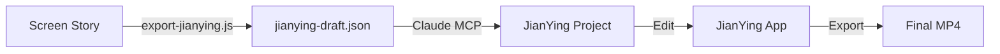

# Using JianYing MCP Server

## Quick Start

### 1. Export from Screen Story
```bash
cd /Users/effyzhang/Documents/effyos/screen_story
node export-jianying.js <session-name>
```

This creates:
```
exports/<session>/
├── jianying-draft.json       # Import this!
├── manifest.json
└── IMPORT_INSTRUCTIONS.txt
```

### 2. Import via Claude

**Option A: Simple (Recommended)**
```
Import my Screen Story draft to JianYing: exports/<session>/jianying-draft.json
```

**Option B: With custom name**
```
Import exports/my-demo/jianying-draft.json to JianYing as "My Awesome Demo"
```

**Option C: Open JianYing automatically**
```
Import my draft and open JianYing: exports/<session>/jianying-draft.json
```

### 3. Edit in JianYing

1. Open JianYing app
2. Find your project in the library
3. Edit, add effects, export!

## Examples

### Basic Import
```
Claude: Import exports/screen-story-completion/jianying-draft.json to JianYing
```

Response:
```
✅ Successfully imported to JianYing!

Project: screen-story-completion
Location: ~/Movies/JianyingPro/User Data/Projects/com.lveditor.draft/screen-story-completion
Videos: 23
Texts: 0

Open JianYing to see your project.
```

### List Existing Projects
```
Claude: List my JianYing projects
```

Response:
```
Found 3 JianYing projects:

- My Demo (45.2s) - Modified: 2026-02-15T10:30:00Z
- screen-story-completion (67.5s) - Modified: 2026-02-15T09:15:00Z
- Tutorial Video (120.0s) - Modified: 2026-02-14T14:20:00Z
```

## What Gets Imported

From your Screen Story export:
- ✅ Screenshots (copied to JianYing Resources)
- ✅ Frame timing (intelligent pacing preserved)
- ✅ Project metadata
- ⏳ Text overlays (coming soon)
- ⏳ Transitions (coming soon)

## Troubleshooting

### "Project doesn't appear in JianYing"
1. Restart JianYing app
2. Check: `ls ~/Movies/JianyingPro/User\ Data/Projects/com.lveditor.draft/`

### "Import failed"
1. Make sure JianYing is installed
2. Check draft exists: `ls exports/<session>/jianying-draft.json`
3. Restart Claude Desktop

### "MCP server not found"
1. Check config: `cat ~/Library/Application\ Support/Claude/claude_desktop_config.json`
2. Should have:
```json
{
  "mcpServers": {
    "jianying": {
      "command": "node",
      "args": ["/Users/effyzhang/Documents/effyos/screen_story/jianying-mcp/index.js"]
    }
  }
}
```
3. Restart Claude Desktop

## Workflow



## Advanced

### Batch Import Multiple Sessions
```bash
# Export all sessions
for session in sessions/*; do
  node export-jianying.js $(basename $session)
done

# Then tell Claude:
# "Import all my Screen Story exports to JianYing"
```

### Custom Project Names
The project name is taken from:
1. Your custom name (if provided to Claude)
2. Session name from export
3. Auto-generated timestamp

## Next Steps

Want more features?
- [ ] Text overlays (captions, timestamps)
- [ ] Transition effects
- [ ] Audio tracks
- [ ] Smart zoom/pan
- [ ] Batch export

Open an issue or submit a PR!
